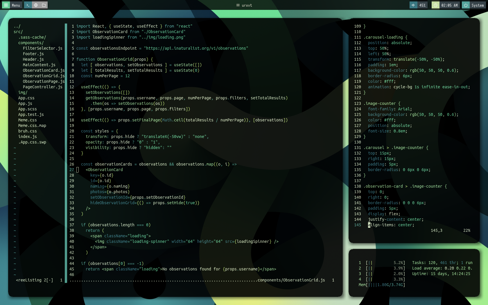

My dotfiles

Reqs:
 - `Plug` for vim plugins: [junegunn/vim-plug](https://github.com/junegunn/vim-plug)
 - [i3-gaps](https://github.com/Airblader/i3), optionally [resloved/i3](https://github.com/resoved/i3) for rounded borders (uncomment border_radius in i3 config)
